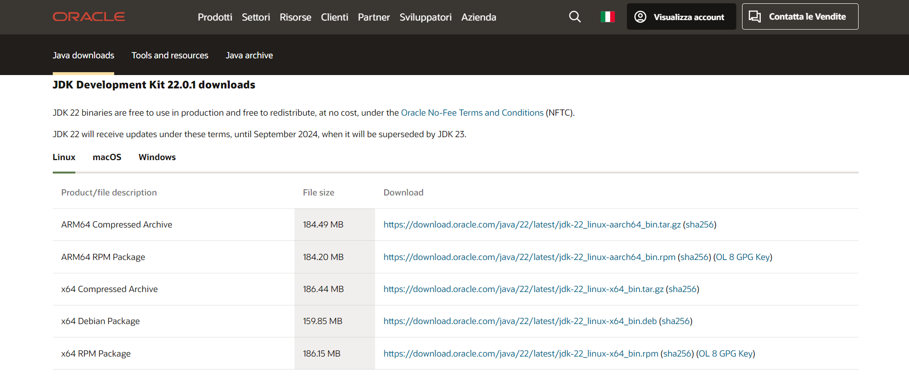
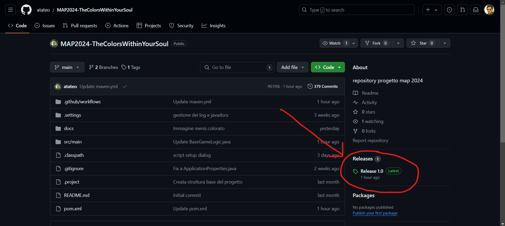
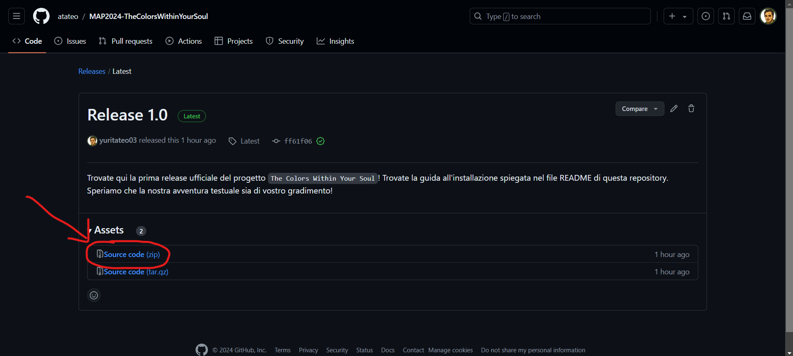
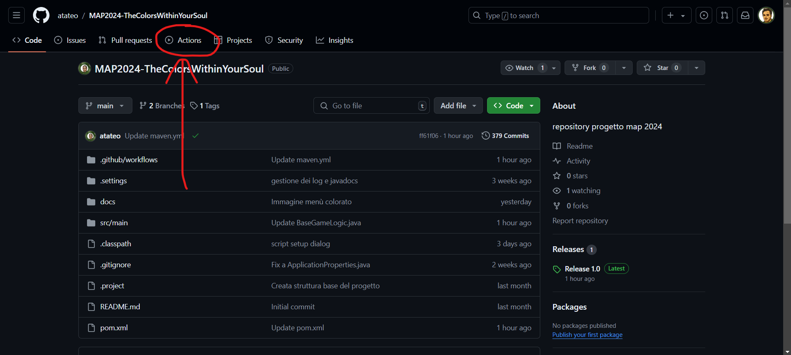
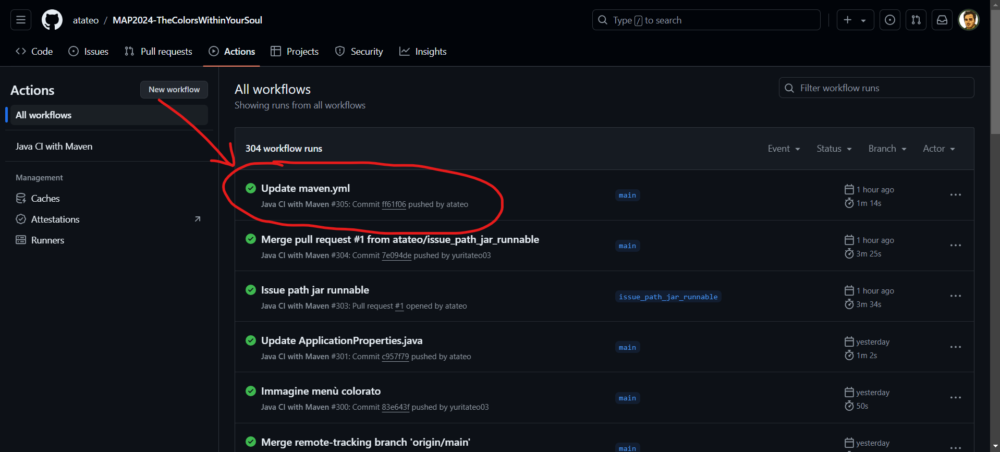
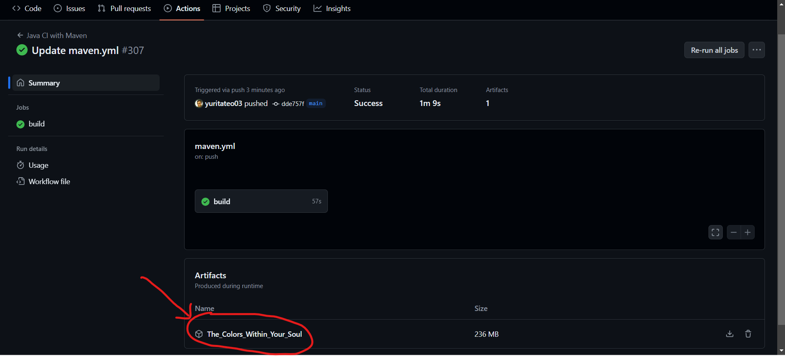
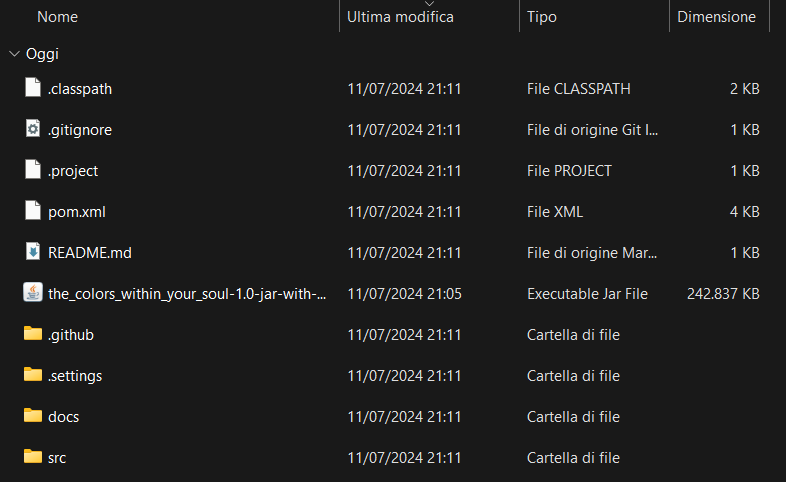

# Guida all'installazione di The Colors Within Your Soul

## Requisiti
Prima di procedere all'installazione, vi consigliamo di dare un'occhiata alla [documentazione](docs/Report.md) del progetto.

Per poter eseguire il nostro gioco è necessario:

- **Una connessione a internet**: Ad un certo punto del gioco viene fatta una richiesta `REST` a un' `API` per una particolare funzionalità di gameplay che non vogliamo spoilerare. Di conseguenza, è richiesto che il gioco venga eseguito mentre si è connessi ad una connessione internet, altrimenti il gioco si bloccherà.
- **Un account GitHub**: Per poter scaricare il file JAR, è necessario essere registrati con un account [GitHub](https://github.com), in quanto è richiesto per accedere al link contenente il download del JAR nella sezione `Artifacts`.
- **Java 22**: Per poter eseguire il nostro progetto è necessario avere installato Java 22. Per controllare la versione di Java installata sul proprio computer è possibile eseguire il comando `java -version` da terminale. Nel caso in cui non fosse installato è possibile scaricarlo dal sito ufficiale di [Oracle](https://www.oracle.com/it/java/technologies/downloads/). Appena aperto il link, vi si presenterà la seguente schermata:

A questo punto sarete già sulla sezione della JDK 22, quindi non dovrete fare altro che cliccare sulla sezione del sistema operativo che state utilizzando e scaricare il file eseguibile.

## Come eseguire il progetto
È necessario scaricare la cartella contenente il codice sorgente e il file `the_colors_within_your_soul-1.0-jar-with-dependencies.jar` nel seguente modo:

- Per scaricare il codice sorgente, sarà sufficiente cliccare sulla <code>Release</code> che si trova a destra della schermata principale della repository. Basterà poi scaricare la cartella <code>Source code (zip)</code> e decomprimerla a download terminato. 
- Dal momento che il progetto utilizza il framework Maven, la gestione del JAR è stata gestita automaticamente usando il `pom.xml` con i suoi plugin e l'utilizzo delle `GitHub Actions`.
  Dunque è sufficiente scaricare il JAR associato all'ultima versione del progetto. 
  Per prima cosa bisogna andare nella sezione `Actions` del repository GitHub del progetto.
  

- Nella sezione `All Workflows` cliccare sulla  `Build` più recente. In questa foto è `Update maven.yml`, ma potrebbe essere diversa per voi. In ogni caso, l'importante è cliccare sulla prima riga, corrispondente all'ultima build eseguita.
  

- A questo punto basta vedere la sezione `Artifacts` e cliccare sul file `the_colors_within_your_soul-1.0-jar-with-dependencies.jar` per scaricarlo.
  

- Nella sezione `Downloads` vi sarà apparso il download del file JAR in un file zip, che dovrete semplicemente spostare sul vostro desktop e spostare il file JAR all'interno della `cartella del progetto`, in questo modo:
  
- Arrivati a questo punto, sarà sufficiente fare doppio click sul file JAR e divertirsi col nostro gioco!

### Esecuzione del JAR tramite IDE

Alternativamente al metodo proposto sopra, si può eseguire il nostro programma semplicemente usando un IDE. Per eseguire il JAR tramite IDE è necessario aprire il progetto in un IDE, come ad esempio IntelliJ IDEA, Eclipse, NetBeans, ecc. 

Una volta aperto l'IDE, è possibile eseguire il JAR cliccando sul file JAR e selezionando l'opzione `Run` o `Esegui`, oppure basta semplicemente eseguire la classe contenente il metodo <code>main()</code> del progetto, ossia la classe `GiocoTestuale.java`, nella cartella `src/main/java/org/it/uniba/giocotestuale`.

