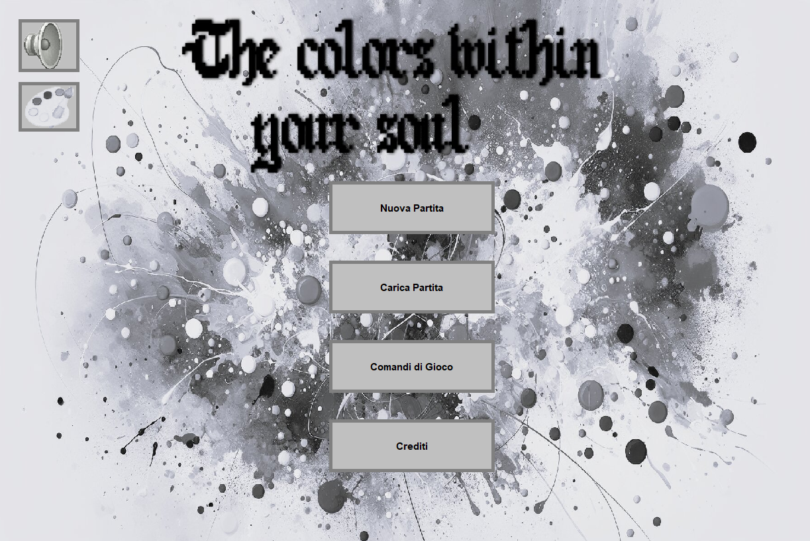
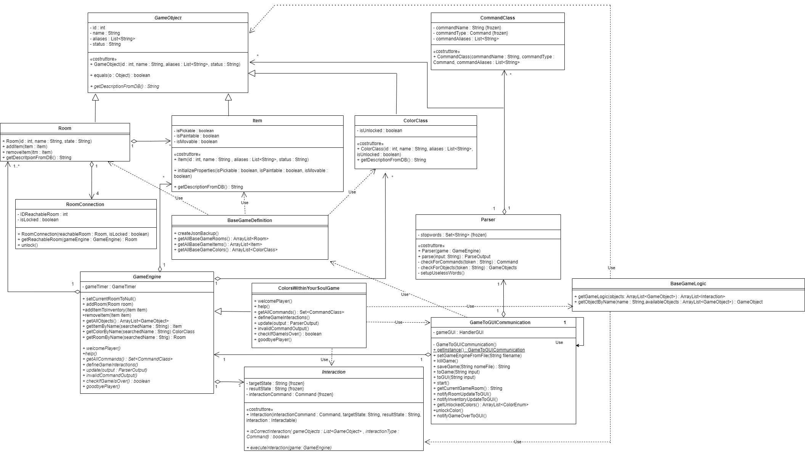
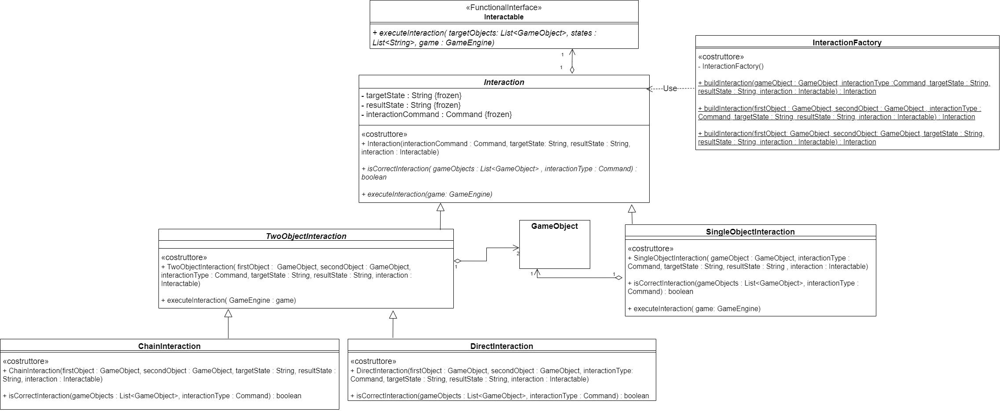

# The Colors Within Your Soul - Report

## Indice
### [Caratteristiche del progetto e del gioco](#Caratteristiche-del-progetto)
> #### [1. Introduzione generale](#Introduzione-generale)
> #### [2. Caratteristiche principali](#Caratteristiche-principali)
> #### [3. Trama del gioco](#Trama-del-gioco)
> #### [4. Walkthrough](#Walkthrough-del-gioco)
> #### [5. Implementazione del progetto](#Implementazione-del-progetto)
### [Utilizzo degli argomenti del corso](#Utilizzo-dei-vari-argomenti-del-corso)
> #### [1. OOP, diagramma delle classi e specifiche algebriche](#Progettazione-OOP)
> #### [2. File](#File)
> #### [3. Database](#Database)
> #### [4. Thread](#Thread)
> #### [5. REST e Socket](#REST-e-Socket)
> #### [6. GUI](#GUI)
> #### [7. Lambda expressions/functions](#Lambda-expressions-e-functions)

## Caratteristiche del progetto
In questa sezione spieghiamo meglio cos'è questo progetto, il suo scopo e alcuni approfondimenti sulla struttura del gioco.
### Introduzione generale
Questo progetto è stato sviluppato come esame per il corso *Metodi Avanzati di Programmazione*, tenuto dal Prof. *Pierpaolo Basile* presso l'Università degli Studi di Bari Aldo Moro. Il titolo del progetto è *The Colors Within Your Soul*. 

L'obiettivo del corso è stato quello di introdurre, conoscere e approfondire un particolare paradigma di programmazione, ossia la Programmazione ad Oggetti e di andare ad utilizzare i concetti appresi per la realizzazione di un progetto software. In particolare, questo è stato fatto mediante lo sviluppo di un'avventura testuale.

Un'avventura testuale è un tipo di videogioco in cui il giocatore interagisce con il mondo di gioco tramite comandi testuali. Questi giochi erano particolarmente popolari nei primi anni dell'era informatica, quando l'elaborazione grafica era limitata.

### Caratteristiche principali
- Interfaccia testuale: l'interazione avviene tramite comandi scritti, come "nord", "prendi torcia" o "osserva".
- Descrizioni degli ambienti: il gioco descrive le scene, gli oggetti e le azioni attraverso testi abbastanza dettagliati, con l'intento di stimolare l'immaginazione del player.
- Puzzle ed esplorazione: i giocatori devono esplorare le stanze e risolvere dei puzzle per avanzare nel gioco, utilizzando azioni varie, oggetti e colori a loro disposizione.

### Trama del gioco
In quest'avventura testuale, giochi nelle vesti di un ragazzo che è cresciuto con suo nonno in una villa a Vieste. Nella speranza di fare carriera, questo ragazzo decide di partire per gli USA, nello specifico a New York, subito dopo la laurea.

Dopo tanti anni, il ragazzo riesce ad ottenere un lavoro d'ufficio abbastanza prestigioso, ma pian piano si rende conto di essersi abituato ad una vita monotona di città che non gli dà lo spazio necessario per esprimersi come persona.

Un giorno, riceve una lettera dalla quale apprende la notizia della morte di suo nonno. Per di più, gli ha lasciato in eredità la villa dov'è cresciuto. Triste per la morte di suo nonno ma deciso a dare una nuova piega alla sua vita, coglie l'occasione per tornare in Italia. Tornato a casa, il ragazzo intraprenderà un'avventura nel piano segreto della villa che gli permetterà di riacquisire i colori perduti della sua anima.


### Walkthrough del gioco
Per la fruibilità del gioco e per dare un aiuto ai player che dovessero rimanere bloccati, abbiamo registrato una playthrough completa del gioco. Consigliamo anche il frequente utilizzo del comando *OSSERVA*, in quanto abbiamo cercato di lasciare dei piccoli aiuti nelle descrizioni di stanze e oggetti. Cliccare l'immagine sotto porterà al video YouTube con la playthrough completa, che ha una durata di circa 6 minuti.

<a href="https://youtu.be/8sHqEgjV5qA">
  
</a>

### Implementazione del Progetto
Il progetto è stato realizzato utilizzando il linguaggio di programmazione Java affiancato al framework Maven per la gestione delle dipendenze e la compilazione del progetto e comprende le seguenti funzionalità principali:

- Parser: trattandosi di un'avventura testuale, il parser è il componente principale del gioco, responsabile di interpretare i comandi inseriti dall'utente e di tradurli in azioni.
- Database: il gioco include un database, in particolare H2, utilizzato per contenere le descrizioni delle stanze, degli oggetti, dei colori e persino i dialoghi di gioco. Lato server, invece, c'è un DB che conserva la classifica dei giocatori.
- Thread: il gioco utilizza i thread per la gestione del tempo di gioco, della musica e per qualche altra chicca come la barra di caricamento. Inoltre, abbiamo lavorato direttamente sull'Event Dispatch Thread per la gestione delle componenti grafiche del gioco.
- File: il gioco utilizza dei file JSON per il salvataggio della configurazione iniziale di gioco e per la gestione dei salvataggi.
- Socket / REST: il gioco effettua una chiamata a un'API per recuperare alcune opere d'arte famose con cui ricompensare il player a fine gioco. I Socket, invece, vengono utilizzati per aprire una comunicazione con un server, permettendo di partecipare alla classifica dei giocatori sulla base del tempo impiegato a finire il gioco.
- GUI: nonostante il gioco sia un'avventura testuale, è stata comunque implementata una finestra di gioco apposita sulla quale vengono stampate alcune informazioni di gioco come inventario del giocatore, stanza corrente e così via.

## Utilizzo dei vari argomenti del corso
In questa sezione approfondiamo l'utilizzo dei vari argomenti di questo corso all'interno di questo corso, spiegando come sono stati implementati e a quali funzionalità corrispondono all'interno del codice. Verranno mostrati anche degli stralci di codice presi dal progetti come esempio, però si noti bene che sono stati inseriti solo a scopo informativo, di conseguenza sono stati semplificati in funzione della spiegazione e non necessariamente riflettono completamente il codice sorgente del nostro gioco.

### Progettazione OOP
Questo progetto è stato sviluppato con l'intento di scrivere un codice quanto più riutilizzabile ed estendibile per il futuro. Sono stati applicati molti principi della OOP tra cui incapsulamento, ereditarietà e polimorfismo. Sono state scritte dunque molte classi con l'intento di dare una definizione generica ad un determinato concetto, eventualmente ereditando poi da tali classi per definire una maggiore specializzazione di quella classe. Ad esempio, abbiamo definito la classe <code>GameEngine</code> come classe astratta che definisce gli attributi e i metodi che un'avventura testuale basata sul nostro codice deve avere. La classe di gioco principale <code>ColorsWithinYourSoulGame</code>, infatti, è una classe che eredita da <code>GameEngine</code> definendo il comportamento di ciascun metodo. Con l'organizzazione in classi che abbiamo scelto, è possibile usufruire di molti metodi già scritti semplicemente ereditando dalle classi che abbiamo già scritto. Ad esempio, la classe <code>GameToGUICommunication</code> usa una generica istanza di <code>GameEngine</code> e, di conseguenza, è possibile usarla su qualunque classe che sia sottoclasse di <code>GameEngine</code> grazie al *principio di sostituibilità delle sottoclassi*. Abbiamo inoltre cercato di scrivere la logica di gioco in modo da poterla rendere quanto più flessibile possibile. Ora, una singola interazione di gioco è definita mediante un oggetto di tipo <code>Interaction</code>, così che l'intera logica di gioco possa essere descritta mediante una serie di oggetti di questa classe. Per aggiungere un'interazione, basterà quindi definire un oggetto di <code>Interaction</code> e aggiungerlo alla lista di interazioni del gioco. Si è anche cercato di fare utilizzo di alcuni design patterns dove ritenuti necessari. Ad esempio, la classe <code>GameToGUICommunication</code> fa da <code>Mediator</code> tra la GUI e l'istanza di gioco, inoltre è una classe <code>Singleton</code>. Un altro esempio è la classe <code>InteractionFactory</code> che, come il nome suggerisce, si occupa di istanziare vari oggetti delle diverse classi della gerarchia di <code>Interaction</code> e utilizza un approccio simile al <code>Factory</code> design pattern.

```java
public abstract class GameEngine {
    private ArrayList<Room> rooms;
    private ArrayList<Item> inventory;
    private ArrayList<Interaction> gameInteractions;
    //...

    public abstract void welcomePlayer();
    public abstract void update();
    public abstract void defineGameInteractions();
    //...
}

public class ColorsWithinYourSoulGame extends GameEngine {
    //Definizione metodi
    //...
    
    public void defineGameInteractions() {
        //Crea e aggiunge un'interazione di gioco
        gameInteractions.add(InteractionFactory.buildInteraction(oggetto1, oggetto2, comando, "stato1", "stato2", () -> {
            //Definizione del comportamento dell'interazione
            //...
        }));
    }
}
```

#### Diagramma delle classi
Qui sotto riportiamo i diagrammi delle classi della porzione di programma che si è deciso di rappresentare, nello specifico la parte di programma che si occupa della definizione del gioco vero e proprio e della gestione della logica di gioco.



#### Specifiche Algebriche
Nel nostro progetto, abbiamo spesso fatto uso delle strutture dati **Mappa** e **Lista**. Ad esempio, le stanze del gioco sono conservate in una lista e ogni stanza ha una lista con gli item in essa contenuta. La mappa, invece, è usata per associare l'ID di una track del mixer al nome della stanza in cui va riprodotta. In questa sezione definiremo le specifiche algebriche per queste due strutture dati.

#### Specifica algebrica della Lista
La lista è una struttura dati che permette di memorizzare e recuperare informazioni sfruttando l'indice di posizione degli elementi contenuti.

#### Specifica sintattica
<table>
    <thead>
        <tr>
            <th colspan="2">Tipi</th>
        </tr>
    </thead>
    <tbody>
        <tr>
            <td colspan="2"><code>List</code>, <code>Item</code>, <code>Integer</code>, <code>Boolean</code></td>
        </tr>
        <tr>
            <td colspan="2" align="center"><strong>Operatori</strong></td>
        </tr>
        <tr>
            <td><code>newList() -> List</code></td>
            <td>Crea una nuova lista vuota</td>
        </tr>
        <tr>
            <td><code>add(List, Item, Integer) -> List</code></td>
            <td>Aggiunge un elemento alla lista nella posizione specificata</td>
        </tr>
        <tr>
            <td><code>isEmpty(List) -> Boolean</code></td>
            <td>Restituisce <code>true</code> se la lista è vuota altrimenti <code>false</code></td>
          </tr>
            <tr>
                <td><code>getSize(List) -> Integer</code></td>
                <td>Restituisce l'ultima posizione occupata da un elemento</td>
            </tr> 
            <tr>
                <td><code>getIndex(List, Item) -> Integer</code></td>
                <td>Restituisce la posizione dell'elemento specificato</td>
            </tr> 
            <tr>
                <td><code>getItem(List, Integer) -> Item</code></td>
                <td>Restituisce l'elemento nella posizione specificata</td> 
            </tr> 
            <tr>
                <td><code>remove(List, Integer) -> List</code></td>
                <td>Rimuove dalla lista l'elemento nella posizione specificata</td>  
            </tr>
            <tr>
                <td><code>contains(List, Item) -> Boolean</code></td>
                <td>Restituisce <code>true</code> se l'elemento specificato è contenuto nella lista</td>
            </tr>
    </tbody>
</table>
Alcuni appunti: <code>Item</code> è un tipo generico usato come placeholder. Può essere rimpiazzato da qualunque tipo di dato. <code>Interger</code> (numeri interi) e <code>Boolean</code> (valori di verità <code>true</code> e <code>false</code>) invece, sono tipi ausiliari alla definizione della specifica algebrica della lista.

#### Osservazioni e Costruttori

<table>
  <thead>
    <tr>
      <th></th>
      <th colspan="2">Costruttori di l'</th>
    </tr>
  </thead>
  <tbody align="center">
    <tr>
      <td><strong>Osservazioni</strong></td>
      <td><code>newList</code></td>
      <td><code>add(l, it, id)</code></td>
    </tr>
    <tr>
      <td><code>isEmpty(l')</code></td>
      <td><code>true</code></td>
      <td><code>false</code></td>
    </tr>
    <tr>
      <td><code>getSize(l')</code></td>
      <td><code>error</code></td>
      <td>if <code>isEmpty(l)</code> then <code>1</code> else <code>getSize(l) + 1</code></td>
    </tr>
    <tr>
      <td><code>getIndex(l', it')</code></td>
      <td><code>error</code></td>
      <td>if <code>it = it'</code> then <code>id</code> else <code>getIndex(l, it')</code></td>
    </tr>
    <tr>
      <td><code>getItem(l', id')</code></td>
      <td><code>error</code></td>
      <td>if <code>id = id'</code> then <code>it</code> else <code>getItem(l, id')</code></td>
    </tr>
    <tr>
      <td><code>remove(l', id')</code></td>
      <td><code>error</code></td>
      <td>if <code>id = id'</code> then <code>l</code> else <code>add(remove(l, id'), it)</code></td>
    </tr>
    <tr>
      <td><code>contains(l', it')</code></td>
      <td><code>false</code></td>
      <td>if <code>it = it'</code> then <code>true</code> else <code>contains(l, it')</code></td>
    </tr>
  </tbody>
</table>

#### Specifica semantica
- **DECLARE**
  - <code>l</code>, <code>l'</code>: <code>List</code>
  - <code>it</code>, <code>it'</code>: <code>Item</code>
  - <code>id</code>, <code>id'</code>: <code>Integer</code>


- **OPERATIONS**
  - <code>isEmpty(newList)</code> = <code>true</code>
  - <code>isEmpty(add(l, it, id))</code> = <code>false</code>
  - <code>getSize(add(l, it, id))</code> = if <code>isEmpty(l)</code> then <code>1</code> else <code>getSize(l) + 1</code>
  - <code>getIndex(add(l, it, id), it')</code> = if <code>it = it'</code> then <code>id</code> else <code>getIndex(l, it')</code>
  - <code>getItem(add(l, it, id), id')</code> = if <code>id = id'</code> then <code>it</code> else <code>getItem(l, id')</code>
  - <code>remove(add(l, it, id), id')</code> = if <code>id = id'</code> then <code>l</code> else <code>add(remove(l, id'), it)</code>
  - <code>contains(newList, it')</code> = <code>false</code>
  - <code>contains(add(l, it, id), it')</code> = if <code>it = it'</code> then <code>true</code> else <code>contains(l, it')</code>

#### Specifica di restrizione
- **RESTRICTIONS**
  - <code>getSize(newList)</code> = <code>error</code>
  - <code>getIndex(newList, it')</code> = <code>error</code>
  - <code>getItem(newList, id')</code> = <code>error</code>
  - <code>remove(newList, id')</code> = <code>error</code>

#### Specifica algebrica della Mappa

- La mappa è una struttura dati che associa una chiave ad un valore, permettendo di memorizzare e recuperare informazioni in modo efficiente.

#### Specifica sintattica
<table>
    <thead>
        <tr>
            <th colspan="2">Tipi</th>
        </tr>
    </thead>
    <tbody>
        <tr>
            <td colspan="2">Map, Key, Value, Boolean, Integer</td>
        </tr>
        <tr>
            <td colspan="2"><strong>Operatori</strong></td>
        </tr>
        <tr>
            <td><code>newMap() -> Map</code></td>
            <td>Crea una nuova mappa vuota</td>
        </tr>
        <tr>
            <td><code>isEmpty(Map) -> Boolean</code></td>
            <td>Restituisce <code>true</code> se la mappa è vuota, <code>false</code> altrimenti</td>
        </tr>
        <tr>
            <td><code>put(Map, Key, Value) -> Map</code></td>
            <td>Aggiunge una coppia chiave-valore alla mappa, o, se già presente, ne aggiorna il valore</td>
        </tr>
        <tr>
            <td><code>get(Map, Key) -> Value</code></td>
            <td>Restituisce il valore associato alla chiave specificata</td>
        </tr>
        <tr>
            <td><code>containsKey(Map, Key) -> Boolean</code></td>
            <td>Restituisce <code>true</code> se la chiave specificata è presente nella mappa</td>
        </tr> 
        <tr>
            <td><code>containsValue(Map, Value) -> Boolean</code></td>
            <td>Restituisce <code>true</code> se il valore specificato è presente nella mappa</td> 
        </tr>
        <tr>
            <td><code>remove(Map, Key) -> Map</code></td>
            <td>Rimuove la chiave ed il valore associato ad essa dalla mappa</td>
        </tr> 
        <tr>
            <td><code>size(map) -> Integer</code></td>
            <td>Restituisce il numero di coppie chiave-valore presenti nella mappa</td>  
        </tr>
    </tbody>
</table>

##### Osservazioni e Costruttori

<table>
  <thead>
    <tr>
      <th></th>
      <th colspan="2">Costruttori di m'</th>
    </tr>
  </thead>
  <tbody align="center">
    <tr>
      <td><strong>Osservazioni</strong></td>
      <td><code>newMap</code></td>
      <td><code>put(m, k, v)</code></td>
    </tr>
    <tr>
      <td><code>isEmpty(m')</code></td>
      <td><code>true</code></td>
      <td><code>false</code></td>
    </tr>
    <tr>
      <td><code>containsKey(m', k')</code></td>
      <td><code>false</code></td>
      <td>if <code>k = k'</code> then <code>true</code> else <code>containsKey(m, k')</code></td>
    </tr>
    <tr>
      <td><code>containsValue(m', v')</code></td>
      <td><code>false</code></td>
      <td>if <code>v = v'</code> then <code>true</code> else <code>containsValue(m, v')</code></td>
    </tr>
    <tr>
      <td><code>get(m', k')</code></td>
      <td><code>error</code></td>
      <td>if <code>k = k'</code> then <code>v</code> else <code>get(m, k')</code></td>
    </tr>
    <tr>
      <td><code>remove(m', k')</code></td>
      <td><code>error</code></td>
      <td>if <code>k = k'</code> then <code>m</code> else <code>put(remove(m, k'), k, v)</code></td>
    </tr>
    <tr>
      <td><code>size(m')</code></td>
      <td><code>0</code></td>
      <td>if <code>isEmpty(m)</code> then <code>1</code> else <code>size(m) + 1</code></td>
    </tr>
  </tbody>
</table>

#### Specifica semantica

- **DECLARE**
  - <code>m</code>, <code>m'</code>: <code>Map</code>
  - <code>k</code>, <code>k'</code>: <code>Key</code>
  - <code>v</code>, <code>v'</code>: <code>Value</code>

- **OPERATIONS**
  - <code>isEmpty(newMap)</code> = <code>true</code>
  - <code>isEmpty(put(m, k, v))</code> = <code>false</code>
  - <code>containsKey(newMap, k')</code> = <code>false</code>
  - <code>containsKey(put(m, k, v), k')</code> = if <code>k = k'</code> then <code>true</code> else <code>containsKey(m, k')</code>
  - <code>containsValue(newMap, v')</code> = <code>false</code>
  - <code>containsValue(put(m, k, v), v')</code> = if <code>v = v'</code> then <code>true</code> else <code>containsValue(m, v')</code>
  - <code>get(put(m, k, v), k')</code> = if <code>k = k'</code> then <code>v</code> else <code>get(m, k')</code>
  - <code>remove(put(m, k, v), k')</code> = if <code>k = k'</code> then <code>m</code> else <code>put(remove(m, k'), k, v)</code>
  - <code>size(newMap)</code> = <code>0</code>
  - <code>size(put(m, k, v))</code> = <code>size(m) + 1</code>


#### Specifica di restrizione

- **RESTRICTIONS**
  - <code>get(newMap, k')</code> = <code>error</code>
  - <code>remove(newMap, k')</code> = <code>error</code>
  
### File
All'interno del nostro progetto, abbiamo utilizzato i file per la memorizzazione di alcune informazioni a lungo termine senza utilizzare il DB. La gestione dei file ci ha permesso di memorizzare e recuperare i dati del gioco in modo persistente, garantendo la continuità dell'esperienza di gioco per gli utenti. Per la maggior parte, abbiamo usato file di tipo JSON per memorizzare i dati in modo strutturato e leggibile, facilitandone la lettura e la manipolazione.

Principalmente, facciamo uso dei file JSON per la gestione dei salvataggi e il caricamento iniziale del gioco. Nel nostro progetto abbiamo un file, <code>start.json</code>, che contiene la definizione del gioco nel suo stato iniziale. Contiene quindi i collegamenti tra le stanze e gli oggetti, tutto quanto nello stato iniziale. Inoltre, la gestione dei salvataggi avviene sempre mediante file JSON. Al salvataggio del gioco, viene generato un file che rappresenta lo stato del gioco al momento del salvataggio, conservando quindi informazioni come lo stato delle stanze e gli oggetti al loro interno, quali oggetti sono nell'inventario del player e in che stato si trova ogni oggetto di gioco.

Per la gestione di questi file, abbiamo creato una classe che si occupi di serializzare e deserializzare gli oggetti di gioco, indipendentemente dal loro stato corrente, così da avere un unica interfaccia per qualsiasi caso. Se il player inizia una nuova partita, verrà semplicemente deserializzato il contenuto di <code>start.json</code>. Se il player vuole invece caricare un salvataggio, gli verrà proposta un'interfaccia per la scelta del file implementata mediante la classe di Java <code>JFileChooser</code> e verrà deserializzato il contenuto del file scelto dal player. La serializzazione del file, invece, avviene al momento del salvataggio della partita. Quando il player decide di salvare, sempre mediante interfaccia di <code>JFileChooser</code>, gli verrà chiesto di decidere il file su cui salvare (è anche possibile creare un nuovo file di salvataggio). Su quel file verrà poi serializzato il contenuto della partita. Abbiamo inoltre definito una classe <code>BaseGameDefinition</code> che contiene vari metodi per la ricostruzione del gioco nel suo stato originale. Se ci dovessero essere problemi all'avvio di una nuova partita, quindi alla deserializzazione di <code>start.json</code>, viene richiamata questa classe, nello specifico il metodo <code>createJsonBackup</code> con lo scopo di creare un'istanza del gioco di base e serializzarla sul file. Il file ricostruito viene quindi deserializzato per far cominciare la partita.

```java
public void createJsonBackup() {
    GameToJson game = new GameToJson();
    //Codice che imposta le caratteristiche dell'oggetto game come se fosse una nuova partita
    //...

    JsonUtil.writeJsonToFile("src/main/resources/static/start.json", game);
}
```

La classe che usiamo per la gestione dei file Json è <code>JsonUtil</code>. In questa classe vengono definiti i metodi <code>readJsonFromFile</code> e <code>writeJsonToFile</code> che si occupano rispettivamente della deserializzazione e della serializzazione degli oggetti di gioco. Anche se non vengono usati, nel caso servano per evoluzioni future del programma, sono stati implementati i metodi <code>getObjectFromJsonString</code> e <code>getJsonStringFromObject</code>, che si occupano rispettivamente di convertire una stringa letta da un file JSON in oggetto e di convertire un oggetto in una stringa che può essere poi scritta su un file JSON. Tutti questi metodi lavorano sul path del file passato come parametro, così da permetterne l'utilizzo indipendentemente da se è richiesta una nuova partita o il caricamento di un salvataggio.

```java
public static void writeJsonToFile(String filePath, Object obj) {
    Gson gson = new Gson();
    String jsonString = gson.toJson(obj);

    try (FileWriter fileWriter = new FileWriter(filePath, false)) {
        fileWriter.write(jsonString);
    } catch (IOException e) {
        logger.error("Eccezione in fase di scrittura del file Json: ", e);
    }
}

public static GameToJson readJsonFromFile(String filePath) {
    Gson gson = new Gson();

    try (FileReader fileReader = new FileReader(filePath)) {
        game = gson.fromJson(fileReader, GameToJson.class);
    } catch (IOException e) {
        logger.error("Eccezione in fase di deserializzazione: ", e);
    }
    return game;
}
```

Notiamo che la classe che sta venendo serializzata è <code>GameToJson</code> e non una classe come <code>ColorsWithinYourSoulGame</code> o <code>GameEngine</code>. Questo perché la classe <code>GameEngine</code> e di conseguenza anche <code>ColorsWithinYourSoulGame</code>, contiene una lista di oggetti della classe <code>Interaction</code> che definiscono la logica di gioco. Questi oggetti non hanno bisogno di essere salvati su file, in quanto la logica di <code>ColorsWithinYourSoulGame</code> è sempre ben definita nella classe <code>BaseGameLogic</code>. Non avrebbe logicamente senso salvare anche la logica di gioco, quindi. Per questo, viene invece serializzata/deserializzata la classe <code>GameToJson</code> che contiene gli attributi del gioco che vanno effettivamente salvati. Quindi, in fase di serializzazione convertiamo prima l'istanza di gioco in <code>GameToJson</code> e successivamente viene salvata su file. Il viceversa vale per la deserializzazione, quindi da file viene letto un oggetto <code>GameToJson</code> che poi viene convertito in istanza di gioco.

Abbiamo usato i file anche per qualche altra parte dell'applicazione. Ad esempio, abbiamo un file <code>application.properties</code> che, come suggerisce il nome, contiene alcune proprietà generali dell'applicazione, ad esempio la versione, dati per la connessione al DB, dati per la connessione all'API, flag vari e path di file utili al programma. Inoltre, il parser legge le stopwords, cioè le parole che deve ignorare in fase di interpretazione del comando (preposizioni, articoli e così via), da un file di testo.
### Database
Nel nostro programma abbiamo usato H2, un database open-source basato su SQL scritto in Java e, appunto, permette l'integrazione di un database SQL nelle applicazioni Java, sia in modalità server che in modalità embedded.

Il database è stato utilizzato al lato Client per la memorizzazione di alcune informazioni di gioco che abbiamo ritenuto poco opportune da memorizzare su file, nello specifico le descrizioni degli oggetti di gioco e i dialoghi. Mediante il database, abbiamo quindi memorizzato le descrizioni di stanze, colori e oggetti, oltre che ai messaggi di gioco come i dialoghi dell'introduzione o i messaggi che vengono restituiti quando il player effettua una determinata azione. Sono state create quindi le tabelle <code>Room</code>, <code>Color</code>, <code>Item</code> e <code>Dialog</code>, ciascuna delle quali dedicata alla memorizzazione delle descrizioni del rispettivo elemento.

A lato Server, invece, il database viene utilizzato per la memorizzazione dei tempi di completamento del gioco dei player che decidono di condividerlo a fine partita. Abbiamo quindi definito una tabella <code>Score</code> che contiene una serie di record definiti dal nome del player e il suo tempo di completamento. Sulla base di questa tabella, poi, viene creata una classifica dei player che hanno completato il gioco nel minor tempo tra tutti.

```SQL
CREATE TABLE IF NOT EXISTS room (id INT AUTO_INCREMENT PRIMARY KEY, stato VARCHAR(20), descrizione VARCHAR(600), id_room INT);
CREATE TABLE IF NOT EXISTS item (id INT AUTO_INCREMENT PRIMARY KEY, stato VARCHAR(20), descrizione VARCHAR(200), id_item INT);
CREATE TABLE IF NOT EXISTS color (id INT AUTO_INCREMENT PRIMARY KEY, descrizione VARCHAR(300));
CREATE TABLE IF NOT EXISTS dialog (id INT AUTO_INCREMENT PRIMARY KEY, testo VARCHAR(500));
CREATE TABLE IF NOT EXISTS score (id INT AUTO_INCREMENT PRIMARY KEY, player VARCHAR(100), time VARCHAR(10));
```

Il database necessita di una connessione per poter essere utilizzato. Per questo, abbiamo quindi deciso di implementare una classe che gestisse questa connessione, che abbiamo chiamato <code>DatabaseConnection</code>. Questa è una classe singleton che gestisce la singola istanza di connessione al database, rendendola lo stesso collegamento al database accessibile a tutto il programma. Si occupa anche di chiudere la connessione a fine programma. Dentro il file <code>application.properties</code> sono definite alcune costanti come URL del database e credenziali di accesso. Queste costanti vengono quindi lette dalla classe <code>DatabaseConnection</code> quando viene aperta la connessione al database, mentre i driver JDBC sono gestiti implicitamente attraverso la classe <code>DriverManager</code>.
```java
// Blocco statico per inizializzare la connessione al database all'avvio della classe.
public class DatabaseConnection {
    //...
  
    static {
        ApplicationProperties appProps = ApplicationProperties.getInstance();

        try {
            conn = DriverManager.getConnection(appProps.getUrlDatabase(), appProps.getUser(), appProps.getPassword());
            logger.info("Connessione aperta");
        } catch (SQLException e) {
            logger.error("Eccezione in fase di apertura della connessione al database: ", e);
        }
    }
    //...
  
    public static void releaseConnection() {
        try {
            conn.close();
        } catch (SQLException e) {
            logger.error("Eccezione in fase di chiusura della connessione al database: ", e);
        }
    }
    
    //...
}
```
Abbiano inoltre definito una classe <code>Setup</code> che definisce le operazioni preliminari che vanno fatte sul database all'avvio del gioco, come la creazione e il popolamento delle tabelle. Questa classe esegue uno script SQL con tutte le istruzioni del caso all'avvio dell'applicazione. Nel caso in cui l'esecuzione dello script non dovesse andare a buon fine, abbiamo anche implementato una classe <code>MockDatabase</code> che si occupa di eseguire comunque le stesse operazioni dello script, ma stavolta direttamente da codice.

```SQL
-- Script di avvio

DROP TABLE Room IF EXIST;
DROP TABLE Item IF EXIST;
-- Altre DROP...

CREATE TABLE Room (...);
CREATE TABLE Item (...);
-- Altre CREATE TABLE..

INSERT INTO Room (0, 'Neutro', 'Ti trovi nell''attico centrale...'), ...;
INSERT INTO Item (0, 'Spento', 'Una torcia semplice...'), ...;
-- Altre INSERT INTO...
```
```java
//Classe Setup
public class Setup {
    //...
  
    public static void setup() {
        String setup = "RUNSCRIPT FROM '" + appProps.getPathSetupDb() + "'";
        boolean eseguito = eseguiIstruzione(setup);
      
        if (!eseguito) {
            //Errore nell'esecuzione, eseguo MockDatabase
            for (String istruzione : MockDatabase.getIstruzioni()) {
                boolean eseguitoMock = eseguiIstruzione(istruzione);
            }
        }
    }
    //...
  
    private static boolean eseguiIstruzione(String setup) {
        Connection connection = DatabaseConnection.getConnection();
        Statement statement;
        
        try {
            statement = connection.createStatement();
            statement.execute(setup);
        } catch (SQLException e) {
            logger.error("Eccezione in fase di esecuzione dell'istruzione: {} - ", setup, e);
            return false;
        }
        
        return true;
    }
    //...
  
}

public class MockDatabase {
    //...
  
    public List<String> getIstruzioni() {
        List<String> istruzioni = new ArrayList<>();
        
        String dropRoom = "DROP TABLE Room IF EXIST;";
        //...
      
        String createRoom = "CREATE TABLE Room (...);";
        //...
      
        String populateRoom = "INSERT INTO Room (...), ...;";
        //...
        
        istruzioni.add(dropRoom);
        istruzioni.add(createRoom);
        istruzioni.add(populateRoom);
        //...
      
        return istruzioni;
    }
    //...
  
}
```
Nel nostro progetto, abbiamo deciso di applicare il pattern architetturale <code>DAO</code> (Data Access Object), che definisce una serie di norme da seguire per l'utilizzo dei database nelle applicazioni Java, nello specifico per la gestione della persistenza. Si tratta di definire una classe per ogni entità tabellare definita nel database, per stratificare e isolare l'accesso alla tabella tramite query (*data layer*) dalla logica operativa dell'applicazione, creando quindi un maggiore livello di astrazione.

Questo significa che nel nostro programma abbiamo definito due classi e un'interfaccia per ogni tabella che abbiamo rappresentato nel database. Ad esempio, per la tabella <code>Item</code>, abbiamo creato una classe <code>ItemRecord</code>, che rappresenta l'entità nel database, quindi possiede attributi che corrispondono ai campi del record, un'interfaccia <code>ItemDao</code>, che contiene i metodi astratti per le operazioni base sulla tabella e infine la classe <code>ItemDaoImpl</code> che implementa e quindi definisce i metodi dell'interfaccia <code>ItemDao</code>. Lo stesso discorso è stato applicato a tutte le tabelle che abbiamo definito precedentemente. Nel nostro programma, molte delle operazioni di base definite da queste classi non vengono utilizzate ma, per una questione di integrità ed estensibilità, del codice si è preferito implementarle comunque.

```java
import java.sql.SQLException;

public class ItemRecord {
  private int id;
  private String stato;
  private String descrizione;
  private int idItem;

  //Metodi getter e setter per i vari attributi
  //...
}

public interface ItemDao {
  //Aggiunta record
  int add(ItemRecord item) throws SQLException;

  //Cancellazione record dato l'ID
  void delete(int id) throws SQLException;

  //Ottieni un record dato l'ID
  ItemRecord getItem(int id) throws SQLException;

  //Ottieni tutti i record
  List<ItemRecord> getItems() throws SQLException;

  //Aggiornamento di un record
  void update(ItemRecord room) throws SQLException;

  //Ottieni la descrizione di un Item dato il suo ID e il suo Stato
  String getDescrizioneByIdItemAndStato(int idItem, String stato) throws SQLException;
}

public class ItemDaoImpl implements ItemDao {
  //Aggiunta record
  public int add(ItemRecord item) throws SQLException {
    String query = "INSERT INTO item (stato, descrizione, id_item) VALUES (?, ?, ?)";

    PreparedStatement ps = conn.prepareStatement(query, Statement.RETURN_GENERATED_KEYS);
    ps.setString(1, item.getStato());
    //...

    ps.executeUpdate();
    return rs.getInt(1);
  }
  
  //Definizione degli altri metodi dell'interfaccia
  //...
}
```
Di queste classi, usiamo principalmente il metodo <code>getDescriptionFromDB()</code> della classe <code>GameObject</code> e tutte le sue sottoclassi (<code>Item</code>, <code>ColorClass</code> e <code>Room</code>) per ricavare la descrizione di un oggetto di gioco dal database. Ad esempio, la classe <code>Item</code>, nella sua definizione del metodo, istanzia un oggetto della classe <code>ItemDaoImpl</code> e ne richiama il metodo <code>getDescrizioneByIdAndStato()</code> passando come parametri l'ID dell'oggetto e il suo stato corrente, così da ricavarne la descrizione dal database. Ad esempio, il comando *OSSERVA [oggetto]* stampa sulla GUI la descrizione dell'oggetto richiesto dopo averla recuperata in questo modo.
```java
public class Item extends GameObject {
    //...
  
    @Override
    public String getDescriptionFromDB() {
        ItemDaoImpl itemDao = new ItemDaoImpl();
    
        try {
            return itemDao.getDescrizioneByIdItemAndStato(super.getId(), super.getStatus());
        } catch (SQLException e) {
            logger.error(e.getMessage());
            return "Strano, neanche io che sono il narratore riesco a descrivere questo oggetto...";
        }
    }
    //...
  
}
```
I dialoghi e i messaggi delle interazioni utilizzano un approccio simile, quindi dichiarando un oggetto di tipo <code>DialogDaoImpl</code> e ricavando il testo dal database usando il metodo apposito passando l'ID fornito come parametro. La differenza è che i dialoghi hanno un ID predefinito, scritto direttamente nel codice, anziché essere salvato come attributo di classe.

Infine, per la gestione degli <code>Score</code> nel server si utilizzano invece molte delle operazioni di base come inserimento e interrogazioni di diverso tipo, in quanto la gestione della classifica richiede l'utilizzo operazioni più variegate.
### Thread
Nel nostro progetto abbiamo utilizzato i Thread per compiere diverse task di supporto in tutto il programma. Sono stati usati per piccole operazioni, come la gestione della progress bar, oppure per implementare funzionalità più importanti come la riproduzione della musica.

Nello specifico, la musica di gioco è stata implementata utilizzando un Thread apposito, in modo che possa essere riprodotta indipendentemente dalle altre operazioni che stanno avvenendo nel resto del gioco. La classe che gestisce la musica è la classe <code>Mixer</code>. La sua particolarità è che estende la classe <code>Thread</code>, così da poter essere eseguita come un Thread apposito a tutti gli effetti.

Il costruttore di questa classe si occupa di caricare i file musicali che abbiamo scelto per il nostro gioco inserendoli in un array di <code>Clip</code>. Viene inoltre inizializzata una <code>Map</code> che associ ogni track al nome della stanza in cui deve essere riprodotta (o al nome della schermata nel caso del menù principale e dei crediti). Si noti che <code>Mixer</code> è una classe singleton, in quanto si usa un'unica istanza di questa classe per tutto il programma.

```java
public class Mixer extends Thread {
    public static Mixer instance;
    private final Clip[] tracks;
    private int currentTrack;
    private boolean isRunning = false;
    private final HashMap<String, Integer> roomNameToTrackIndex;
    
    private Mixer() {
        final int numberOfTracks = 10;

        this.tracks = new Clip[numberOfTracks];
        roomNameToTrackIndex = new HashMap<>();

        //Caricare qui la musica del gioco in tracks;
        loadTrack(0, "src/main/resources/music/AA_AJ_DrewMishamStudio.wav");
        //...

        //Scrivere qui il codice che associa l'indice della musica alle stanze
        roomNameToTrackIndex.put("Menu", 0);
        //...
    }

    public static Mixer getInstance() {
        if (instance == null) {
          instance = new Mixer();
        }
        return instance;
    }
}
```

L'utilizzo dei Thread entra in gioco per la riproduzione della musica. Viene ridefinito il metodo <code>run()</code> che la classe <code>Mixer</code> eredita dalla classe <code>Thread</code>. Questo metodo si occupa di far partire la track iniziale permettendo la riproduzione della musica nell'intero programma. All'esterno della classe <code>Mixer</code>, ci sarà una chiamata del tipo <code>Mixer.getInstance().start()</code> che farà partire il Thread apposito e la riproduzione della musica per tutto il programma.

```java
//All'interno della classe Mixer
@Override
public void run() {
    isRunning = true;
    try {
        if (tracks[0] != null) {
            tracks[0].start();
            tracks[0].loop(Clip.LOOP_CONTINUOUSLY);
            currentTrack = 0;
        }
    } catch (Exception e) {
        logger.error(e.getMessage());
    }
}

//Altra classe
public class HandlerGUI {
    //...
  
    public void initComponents() {
        //...
        
        Mixer.getInstance().start();
    }
}
```
Oltre a questo, ci sono altri metodi di supporto come <code>startTrack()</code>, <code>stopTrack()</code>, <code>changeRoomMusic()</code> e altri che aiutano nella gestione della musica.

Oltre alla musica di gioco, facciamo uso dei Thread per altre task più piccole, come ad esempio la gestione della barra di caricamento. Specificatamente, viene istanziato un oggetto della classe <code>TimerTask</code> ridefinendone il metodo <code>run()</code> per scriverci il codice che fa avanzare la progress bar. Quest'istanza viene poi passata a un oggetto della classe <code>Timer</code> del package <code>java.util</code>, nello specifico al metodo <code>scheduleAtFixedRate()</code>. Questo metodo prenderà l'istanza di <code>TimerTask</code> che abbiamo istanziato sopra e la eseguirà a cadenza regolare, simulando quindi l'avanzamento di una progress bar sulla finestra di caricamento.

```java
public void startProgressBar() {
    counter = 0;
    Timer timer = new Timer();
    TimerTask taskProgressBar = new TimerTask() {
        @Override
        public void run() {
            if (counter < 100) {
                counter++;
                //Simula l'avanzamento della progress bar
                //...
            } else {
                //Gestisce la fine del caricamento
                Timer timerlw = new Timer();
                TimerTask taskProgressBarLastWord = new TimerTask() {
                    @Override
                    public void run() {
                        setFinished(true);
                        timerlw.cancel();
                    }
                };
                timerlw.schedule(taskProgressBarLastWord, 500);
                timer.cancel();
            }
        }
    };
    
    //Schedula l'esecuzione dell'update della progress bar ogni 20 ms
    timer.scheduleAtFixedRate(taskProgressBar, 0, 20);
}
```

Altre operazioni che abbiamo eseguito utilizzando i Thread includono aggiornamento di elementi di GUI utilizzando il metodo <code>scheduleAtFixedRate()</code> come spiegato sopra (l'aggiornamento del label del timer, per esempio). Abbiamo anche fatto un utilizzo indiretto dei Thread lavorando con l'<code>Event Dispatch Thread</code> che gestisce il flow della GUI, oppure utilizzando alcune classi che si appoggiano sui Thread come <code>System</code>, nello specifico utilizzando il metodo <code>currentTimeMillis()</code> sulla quale è basato l'intero funzionamento della classe <code>GameTimer</code>, che gestisce il timer di gioco.
### REST e Socket

Per implementare un sistema di comunicazione client/server abbiamo realizzato un client <code>REST</code> e utilizzato i <code>Socket</code> per gestire la classifica con i migliori tempi ottenuti per la soluzione del gioco.
Il client <code>REST</code> si interfaccia con il <code>WebService</code> pubblico <code>ArtSy</code>, un sistema molto complesso che condivide migliaia di opere d'arte di artisti di ogni genere ed epoca.
<code>ArtSy</code> prevede l'utilizzo delle proprie <code>API</code> previa iscrizione al servizio e l'ottenimento di un token applicativo <code>X-XAPP-Token</code> che viene utilizzato in tutte le chiamate di ogni operazione.
Per semplificare le operazioni di recupero delle opere d'arte, abbiamo effettuato un'attività di scouting che partendo dal nome dell'artista, ci ha portato a definire un set di undici opere d'arte predefinite.
Queste opere d'arte sono state catalogate nel file <code>application.properties</code>. Quando viene effettuata una richiesta all'API, viene estratto casualmente un ID utilizzato per recuperare tramite opportuna <code>API</code> la specifica opera d'arte. Questo rende ancora più interessante l'esperienza di gioco, permettendo ad un player che termini il gioco più volte di ottenere opere d'arte potenzialmente diverse ogni volta.
```java
// Estrae randomicamente l'id dell'opera d'arte da un elenco predefinito
Random random = new Random();
int n = appProps.getIdArtwork().length - 1;
int nRandom = random.nextInt(n + 1);
```

La classe <code>ClientRest</code> implementa principalmente due metodi, uno che effettua le chiamate in <code>POST</code> e uno che effettua le chiamate in <code>GET</code>. Gli altri metodi <code>PUT</code> e <code>DELETE</code> non sono stati considerati poichè non sono utili nel nostro progetto.
Il metodo <code>executePost</code> è stato utilizzato per recuperare il token di autenticazione fornendo in input l'<code>url</code> e le credenziali <code>client_id</code> e <code>client_secret</code> di accesso:
```java
//Esegue la chiamata in POST verso il servizio di autenticazione
String jsonResponse = executePost(url + "?client_id=" + clientID + "&client_secret=" + secret);

if (jsonResponse != null && !jsonResponse.isEmpty()) {
    // Estrae il token che sarà utilizzato per il servizio GET
    JsonObject jsonObject = JsonParser.parseString(jsonResponse).getAsJsonObject();
    String token = jsonObject.get(TOKEN).getAsString();
}
```
Mentre il metodo <code>executeGet</code> è stato utilizzato per il recupero dell'opera d'arte e del relativo artista:
```java
String urlOpere = appProps.getUrlEndpoint() + URL_ARTWORK + idArtwork;
String jsonOpera = executeGet(urlOpere, token);

if (jsonOpera != null && !jsonOpera.isEmpty()) {
	Gson gson = new Gson();
	Artwork artwork = gson.fromJson(jsonOpera, Artwork.class);
	if (artwork != null) {

		Links links = artwork.getLinks();
		if (links != null) {
			if (links.getImage() != null && links.getImage().getHref() != null) {
				String urlImmagine = links.getImage().getHref().replace("{image_version}", "large");
				operaDArte = getImage(urlImmagine);
				nameArtwork = artwork.getTitle();
				artworkResponse.setArtwork(operaDArte);
				artworkResponse.setNameArtwork(nameArtwork);
			}
			if (links.getArtists() != null && links.getArtists().getHref() != null) {
				String urlArtista = links.getArtists().getHref();
				String jsonArtista = executeGet(urlArtista, token);
				if (jsonArtista != null && !jsonArtista.isEmpty()) {
					artworkResponse.setNameArtist(getNameArtist(jsonArtista));
				}
			}
		} else {
			nameArtwork = "Opera d'arte non più disponibile";
		}
    	}
}
```

La deserializzazione della response è effettuata tramite la libreria <code>Gson</code> che estrae gli attributi dalla stringa e li associa agli attributi definiti nell'oggetto <code>Artwork</code>. Il tipo di ritorno del client è un bean <code>ArtworkResponse</code> che definisce gli attributi <code>nameArtist</code> e <code>nameArtwork</code> di tipo <code>String</code> e <code>byte[]</code>, rispettivamente. Viene anche salvato il nome dell'artista come stringa.

```java
//Deserializzazione response
Artwork artwork = gson.fromJson(jsonOpera, Artwork.class);

//Ritorno del client
private byte[] artwork;
private String nameArtwork;
private String nameArtist;
```

Per recuperare il nome dell'artista dalla relativa response, si è scelto di non effettuare una deserializzazione completa ma si è proceduto a recuperare l'attributo direttamente, in quanto venivano forniti molti attributi non necessari allo scopo del nostro programma.

```java
JsonObject jsonObject = JsonParser.parseString(jsonString).getAsJsonObject();

// Uso una lambda per recuperare il nome dell'artista dalla struttura del json fornito in input
Optional<String> name = Optional.ofNullable(jsonObject)
		.map(obj -> obj.getAsJsonObject("_embedded"))
		.map(embedded -> embedded.getAsJsonArray("artists"))
		.flatMap(artists -> !artists.isEmpty() ? Optional.of(artists.get(0).getAsJsonObject()) : Optional.empty())
		.map(artist -> artist.get("name").getAsString());

// Ritorna il nome dell'artista o null se non riesce a recuperarlo
return name.orElse("Artista sconosciuto");
```

Al termine del gioco, la classe <code>ClientRest</code> si occupa di recuperare l'opera d'arte fornendola alla classe <code>GameGUI</code> così che quest'ultima possa renderizzarla a video nel frame di gioco.

La gestione della classifica è stata realizzata mediante utilizzo di apposita tabella, come già indicato nella sezione database.
Per le operazioni di inserimento di un nuovo punteggio e il recupero della lista, sono stati implementati i <code>Socket</code>.
All'avvio del gioco, la main class si occupa di inizializzare il <code>GameServer</code> sulla porta indicata nel costruttore:

```java
public GameServer(int port) {
	try {
		serverSocket = new ServerSocket(port);
	} catch (IOException e) {
		logger.error("Errore durante la creazione del server: ", e);
	}
	logger.info("Server creato");
}
```
La classe server implementa il metodo <code>start</code> che pone in ascolto il server socket e si predispone per accettare le chiamate in ingresso. Sulla base dell'operazione definita dal client, effettua le due principali operazioni.
- <code>POST</code> indica che si sta chiedendo al server di effettuare l'inserimento del tempo impiegato dal player per completare il gioco.
- <code>GET</code> indica che si sta chiedendo al server di restituire la lista dei primi dieci migliori tempi se presenti o dei primi "n" se il numero di tempi è minore di dieci.

Catturata la richiesta del client, il server esegue il ramo di codice selezionato. Anche se non sono è previsto che il client invii comandi differenti, è stato gestito il caso di default input errato.

```java
while (true) {
	try (Socket clientSocket = serverSocket.accept();
		 ObjectOutputStream out = new ObjectOutputStream(clientSocket.getOutputStream());
		 ObjectInputStream in = new ObjectInputStream(clientSocket.getInputStream())) {
		 //...
		 switch (input) {
			case "POST" -> {
				ScoreDaoImpl scoreDaoImpl = new ScoreDaoImpl();
				Score score = (Score) in.readObject();
				try {
					int keyGenerated = scoreDaoImpl.add(score);
					out.writeObject("Operazione di inserimento eseguita correttamente. KEY=" + keyGenerated);
				} catch (SQLException e) {
					logger.error("Operazione di inserimento fallita", e);
					out.writeObject("Operazione di inserimento fallita");
				}
			}
			case "GET" -> {
				ScoreDaoImpl scoreDaoImpl = new ScoreDaoImpl();
				try {
					out.writeObject(scoreDaoImpl.getScores(10));
				} catch (SQLException e) {
					logger.error("Eccezione in fase di recupero della classifica: ", e);
					out.writeObject("Eccezione in fase di recupero della classifica: " + e);
				}
			}
            		//...
			default -> {
				out.writeObject("Operazione non valida");
			}
		}
	}
}
```
Il server, in linea teorica, dovrebbe essere eseguito come applicazione a se stante ma per comodità di gestione viene eseguito nel gioco.
Il client è invece parte integrante del programma ed è utilizzato per alimentare la classe <code>ScoreGUI</code>.
La classe <code>GameClient</code> definisce il metodo <code>startConnection</code> che si occupa di istanziare un socket sull'indirizzo e porta passati come parametro, inizializzando gli oggetti che si occupano di gestire l'input e l'output nella comunicazione:

```java
public void startConnection(String ip, int port) throws UnknownHostException, IOException {
	clientSocket = new Socket(ip, port);
	out = new ObjectOutputStream(clientSocket.getOutputStream());
	in = new ObjectInputStream(clientSocket.getInputStream());
}
```

Sempre nalla classe <code>GameClient</code> sono definiti i metodi che si occupano di inviare il tempo di gioco al server e recuperare la lista dei primi dieci migliori tempi:

```java
//Invia Score
public String sendScore(Score score) {
    String resp = null;
    try {
        out.writeObject("POST");
        out.writeObject(score);
        resp = (String) in.readObject();
        logger.info("Risposta del server: {}", resp);
        //...
    } catch (Exception e) {
        //...
    }
}

//Ricevi top 10 Score
public List<Score> getScores() {
    List<Score> punteggi = new ArrayList<>();
    
    try {
        out.writeObject("GET");
      
        List<?> response = (List<?>) in.readObject();
        for (Object o : response) {
            Score score = (Score) o;
            punteggi.add(score);
        }
    } catch (IOException | ClassNotFoundException e) {
        //...
    }
    punteggi.sort(Comparator.comparingInt(a -> formatTimeFromStringToInt(a.getTime())));
    return punteggi;
}
```

La classe <code>ScoreGUI</code> utilizza <code>GameClient</code> per inviare il tempo di gioco del player e ricevere la lista aggiornata dal server. 
Il metodo <code>addScore</code> avvia la connessione verso il server, richiama il metodo <code>sendScore</code> del client e chiude la connessione verso il server.

```java
private void addScore(Score score) {
    if (score != null) {
        GameClient client = new GameClient();
        try {
            client.startConnection("localhost", 3999);
            String resp = client.sendScore(score);
            client.stopConnection();
            //...
        } catch (...){
            //..
        }
    }
}
```

Il metodo <code>getScores</code> avvia la connessione verso il server, richiama il metodo <code>getScores</code> del client e chiude la connessione verso il server.

```java
private List<Score> getScores() {
	GameClient client = new GameClient();
	List<Score> scores = new ArrayList<>();
	try {
		client.startConnection("localhost", 3999);
		scores = client.getScores();
		client.stopConnection();
    } catch (...){
        //...
    }
}
```

Tutte le operazioni salienti e le eventuali eccezioni sono gestite dal framework <code>logj4</code>. I messaggi di errore sono comunque gestiti nella comunicazione client/server.

### GUI

### Lambda expressions e functions
In questo progetto, abbiamo utilizzato le lambda functions per una serie di funzioni chiave al funzionamento del programma. Come già anticipato nella sezione OOP, la logica di gioco è composta da una serie di interazioni che determinano cosa accade quando si esegue un'azione su un singolo oggetto (<code>SingleObjectInteraction</code>), cosa accade quando si esegue un'azione che include due oggetti (<code>DirectInteraction</code>) e cosa accade a un oggetto quando un altro oggetto riceve un cambiamento di stato (<code>ChainInteraction</code>). In ognuno di questi casi, le azioni che il gioco deve eseguire quando viene ricevuto un determinato comando su determinati oggetti vengono definite mediante una lambda function. Nello specifico, la classe <code>Interaction</code> ha come attributo un oggetto di tipo <code>Interactable</code>, che è un'interfaccia funzionale che include solo il metodo <code>executeInteraction</code>. Questo metodo è quello che effettivamente esegue l'interazione sugli oggetti interessati prendendo in input l'istanza di <code>GameEngine</code> che rappresenta l'istanza di gioco. Per definire un'interazione, bisogna quindi istanziare un oggetto della categoria di classi <code>Interaction</code> istanziando l'interfaccia funzionale <code>Interactable</code> mediante una lambda function che verrà passata come parametro. Qui sotto riportato un esempio pratico che definisce cosa succede col comando "USA Orologio SU Incavo" quando l'orologio è nello stato "Aggiustato":

```java
public ArrayList<Interaction> getGameLogic() {
    //Usare l'orologio aggiustato sull'incavo per riempirlo
    gameLogic.add(InteractionFactory.buildInteraction(
            getObjectByName("Orologio", objects), getObjectByName("Incavo", objects), Command.USA, "Aggiustato", "Pieno",
            (gameObjects, targetStates, gameEngine) -> {
                    gameObjects.get(1).setStatus(targetStates.get(1));
                    ((Item) gameObjects.getFirst()).setPickable(false);
    
                    gameEngine.getRoomByName("StanzaViola").getRoomConnection(Command.NORD).unlock();
                    gameEngine.getRoomByName("StanzaViola").addItem((Item) getObjectByName("Orologio", objects));
                    gameEngine.getRoomByName("AtticoCentrale").getRoomConnection(Command.NORD).unlock();
                    gameEngine.removeItem((Item) getObjectByName("Orologio", objects));
    
                    GameToGUICommunication.getInstance().toGUI("Messaggio");
            }
    ));

    //...

    return gameLogic;
}
```

Quando il metodo <code>update()</code> scorrerà la lista di <code>Interactions</code> e, quando viene trovata un'interazione che corrisponde all'output ricevuto dal parser (se viene trovata), verrà eseguita l'istanza ddell'interfaccia funzionale <code>Interactable</code> istanziata mediante la lambda function. Questo permette di definire l'intera logica di gioco mediante una serie di lambda functions.

Le lambda expressions sono state usate anche come supporto in altri punti del programma. Nello specifico, sono state utilizzate per compiere queste funzioni:
- Supporto per la creazione e la gestione della GUI: In alcuni casi, abbiamo fatto uso delle lambda expressions per la gestione delle GUI. Ad esempio, abbiamo definito il comportamento dei listener di alcuni pulsanti mediante lambda expressions, oppure abbiamo ridefinito alcuni metodi come <code>paintComponent()</code> di <code>JPanel</code> per l'aggiornamento dinamico della GUI, oppure sono state usate per impostare delle task che la GUI doveva eseguire con un certo delay o con una certa cadenza con i metodi <code>SwingUtilities.invokeLater()</code> e <code>Timer.scheduleAtFixedRate()</code>, ad esempio per l'update delle immagini di gioco al cambio di stanza e per l'update del <code>JLabel</code> contenente il timer di gioco.
- Supporto nella ricerca e nel filtraggio di elementi all'interno delle strutture dati: In alcuni casi, abbiamo fatto uso delle lambda expressions per ciclare delle strutture dati alla ricerca di un determinato elemento o applicando un filtro. Ad esempio, nella classe <code>ClientRest</code>, abbiamo fatto uso delle lambda expressions per ricavare il nome dell'artista dalla risposta ricevuta dall'API, oppure nella classe <code>Parser</code> ne abbiamo fatto uso per dividere la stringa di input in tokens, togliendo tutti i token inclusi nella lista di stopwords. Allo stesso modo è stato implementato anche il comando *BACK*, che permette al player, quando si trova in una stanza con una singola porta, di uscire da quella porta. Abbiamo utilizzato una lambda expression che ciclasse i vari attributi <code>RoomConnection</code> della stanza corrente, inserendo in una lista solo i collegamenti non nulli. Sulla base di quella lista, poi, esegue il comando.
```java
//Classe ClientRest
private static String getNameArtist(String jsonString) {
    JsonObject jsonObject = JsonParser.parseString(jsonString).getAsJsonObject();
    
    //Lambda function che recupera il nome dell'artista 
    Optional<String> name = Optional.ofNullable(jsonObject)
                    .map(obj -> obj.getAsJsonObject("_embedded"))
                    .map(embedded -> embedded.getAsJsonArray("artists"))
                    .flatMap(artists -> !artists.isEmpty() ? Optional.of(artists.get(0).getAsJsonObject()) : Optional.empty())
                    .map(artist -> artist.get("name").getAsString());
    
    //...
}

//Classe Parser
public ParserOutput parse(String input) {
    String[] tokens;
    
    //Lambda function che divide la stringa di input in token filtrando le stopwords
    //e convertendo tutto in minuscolo, salvando poi i token nell'array di stringhe tokens
    tokens = Arrays.stream(input.split("\\s+"))
          .map(String::toLowerCase)
          .filter(w -> !stopwords.contains(w))
          .toArray(String[]::new);
    
    //...
}

//Classe ColorsWithinYourSoulGame
public void update(ParserOutput output) {
    //...
    if (output.getCommandType() == Command.BACK) {
        List<RoomConnection> destination;

        //Lambda expression che travasa in una lista i collegamenti non nulli della stanza corrente
        destination = Arrays.stream(Command.values())
                    .map(getCurrentRoom()::getRoomConnection)
                    .filter(connection -> connection != null)
                    .collect(Collectors.toList());

        //...
    }
    //...
}
```
